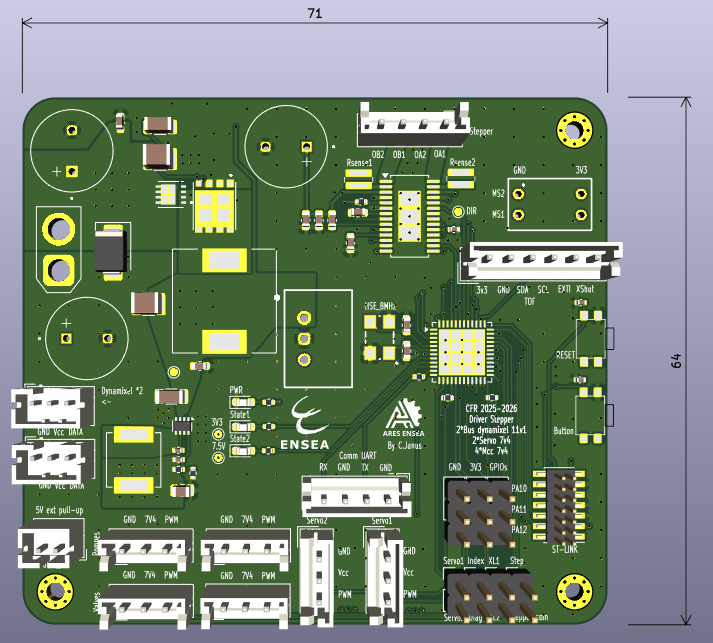
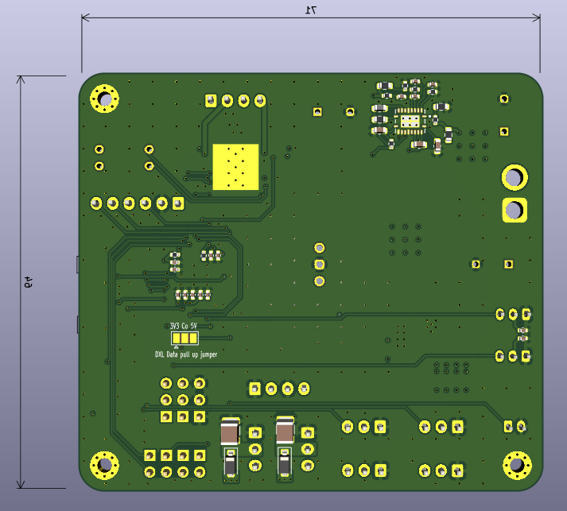

# Contrôleur "Rail-Bras-Ventouses" (STM32G4 + TMC2226)

Ce PCB est la carte de contrôle centrale du sous-système de préhension du robot. Elle orchestre les mouvements du rail, du bras et la gestion des ventouses.
Elle intègre une architecture de puissance à plusieurs étages pour gérer différents niveaux de tension (24V, 12V, 7.4V, 3.3V) à partir d'une batterie 6S, tout en pilotant une grande variété d'actionneurs via un **STM32G431**.

## ⚡ Architecture d'Alimentation (Power Tree)

L'alimentation est distribuée en cascade pour optimiser le rendement et la stabilité :

1.  **Entrée Principale :** Batterie LiPo 6S (~22.2V - 25.2V).
2.  **Étage 1 (V_BAT ➔ 12V) :** Buck **TI LM25145**.
    * *Usage :* Alimentation des Dynamixels et source pour les étages suivants.
3.  **Étage 2A (12V ➔ 7.4V) :** Buck **TI TPS563300**.
    * *Usage :* Alimentation de puissance pour les Servomoteurs classiques et les 4 moteurs DC (MCC).
4.  **Étage 2B (12V ➔ 3.3V) :** Module de puissance **Würth Elektronik MagI³C (173010x78)**.
    * *Usage :* Alimentation propre pour la logique (STM32, Capteurs).

## 🧠 Cœur Logique : STM32G431CBU6

* **MCU :** ARM Cortex-M4 à 170 MHz (Série G4 optimisée pour le contrôle moteur/mixte).
* **Programmation :** Connecteur **ST-Link** dédié (SWD).
* **Interface Utilisateur :**
    * 1x LED Power (3.3V).
    * 2x LEDs d'état (pilotables par GPIO).
    * 1x Bouton Reset.
    * 1x Bouton User (connecté sur GPIO/EXTI).

## 🦾 Contrôle Actionneurs

### 1. Axe "Rail" (Stepper) - TMC2226-SA
* **Driver :** Trinamic TMC2226 (Ultra-Silent).
* **Tension :** 24V (V_BAT).
* **Configuration :**
    * **Rsense :** 390 mΩ (Définit la plage de courant : Irms=0.56A).
    * **Microstepping :** Configurable via **DIP Switch** embarqué.
    * **Interface :** STEP / DIR + UART (Diag).
* **❄️ Gestion Thermique Avancée :**
    * Le Pad thermique du TMC2226 est soudé sur un large plan de cuivre.
    * Réseau de **vias thermiques** traversant le PCB vers une zone de cuivre exposée sur la face opposée.
    * Emplacement prévu pour coller une ailette de refroidissement (heatsink) directement sur la zone arrière.

### 2. Bras & Ventouses
* **2x Servomoteurs :** Alimentés en 7.4V (PWM direct).
* **2x Dynamixels :** Connecteurs dédiés (GND, 12V, Data).
    * *Protocole :* UART Half-Duplex (compatible protocole Robotis).
* **4x Moteurs DC (MCC) :** Sorties alimentées en 7.4V (pour pompes à vide/ventouses).

## 🔌 Connectivité & Capteurs

* **Capteur ToF (Time of Flight) :** Connecteur dédié (I2C + GPIOs + 3.3V).
* **Expansions :** 3 rangées de headers [GND - 3V3 - GPIO] pour ajouts futurs.

## 🐛 Debug & Instrumentation

Le PCB intègre des points de test (headers) regroupés pour faciliter l'analyse à l'oscilloscope ou à l'analyseur logique :

* `PWM_Servo1`, `PWM_Servo2`
* `UART_Dynamixel1`, `UART_Dynamixel2`
* `STEP`, `PDN`, `INDEX`, `DIAG` (Signaux du TMC2226)

## 🛠️ Vues du PCB

| Face Composants | Face Cuivre |
| :---: | :---: |
|  |  |

---
## License

This hardware project is licensed under the **CERN Open Hardware Licence Version 2 - Strongly Reciprocal (CERN-OHL-S v2)**.

You may redistribute and modify this documentation and make products using it under the terms of the CERN-OHL-S v2. If you modify or distribute this design, you must share your modifications and the entire product it is integrated into under the same open-source license.

Designed by C. Janus.